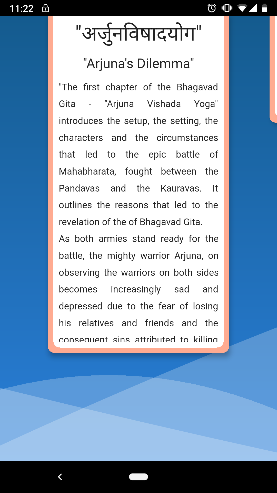

#  Flutter Animated UI :- 

This repository contains an animated UI which is implemented using **[FLUTTER](https://flutter.io/)** and 
below I am attaching the output which you will get once you run this repo.
If you like the animation your star ⭐️⭐️⭐️⭐️⭐️ to repo will definitely motivate me 👦🏻😃.

## Output📱
   
